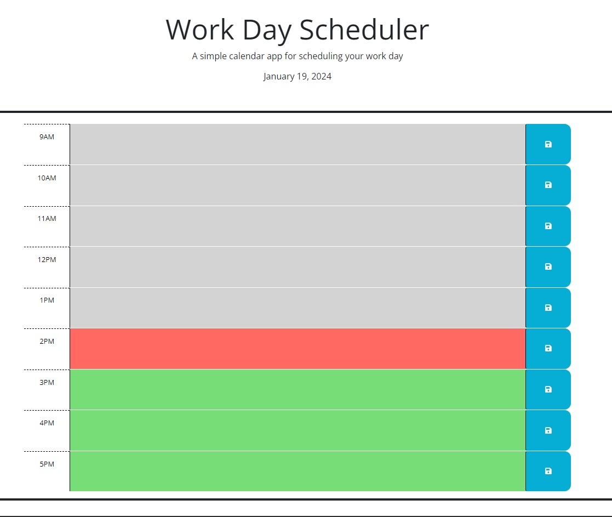

# Work-Day-Scheduler

## Description
This app is a scheduler for one day between 9am and 5pm.  You can enter appointments and such
into the hour needed and save the information to retrieve at a later time.  A color system 
helps identify what has past, what is current, and what is to come.

## Installation
Navigate to https://carioto.github.io/Work-Day-Scheduler/ to start using this app.

## Usage

Click on any timelot to add details for that slot.  When complete, select the save icon at the 
far right of each slot to save your data. Refresh your page to update.

## Credits

Studying some examples on Github from sylviaprabudy and EdenKhaos, as well as code review on
MDN were invaluable to success.  Instruction from  UPENN-VIRT-FSF-PT-12-2023-U-LOLC repository 
continues to be a strong reference to class learnings. 

## License
Please see the MIT License in the root directory of this app.